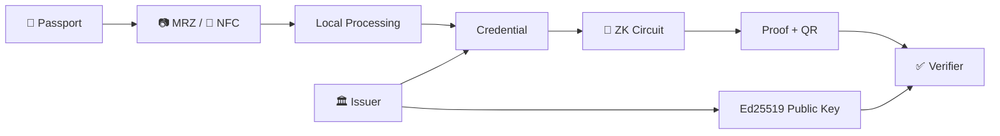

<div align="center">

# ◈ ZK PASSPORT ◈

### **PRIVATE IDENTITY • PUBLIC PROOF**

<p>
  
  
  
  
</p>

```text
┌───────────────────────────────────────────────────────────────────┐
│                                                                   │
│    PHYSICAL IDENTITY          CRYPTOGRAPHIC CLAIM                │
│                                                                   │
│          🪪                       🔐                              │
│          │                        │                              │
│          └──────────────┬─────────┘                              │
│                         ▼                                        │
│                  ZERO-KNOWLEDGE                                  │
│                         │                                        │
│                         ▼                                        │
│              ┌─────────────────────┐                             │
│              │  PROVE • DON'T      │                             │
│              │      EXPOSE         │                             │
│              └─────────────────────┘                             │
│                                                                   │
└───────────────────────────────────────────────────────────────────┘
```

**An experimental self-sovereign identity wallet that turns passport data into verifiable digital credentials and zero-knowledge proofs.**

> ### The passport contains the data.
> ### The proof contains the answer.

</div>

---

## ▌01 — THE PROBLEM

A passport can answer dozens of questions.

Most verifiers only need **one**.

```text
                         PASSPORT
                ┌──────────────────────┐
                │ Name                 │
                │ Date of Birth        │
                │ Passport Number      │
                │ Nationality          │
                │ Gender               │
                │ Expiry Date          │
                │ Issuing Country      │
                └──────────┬───────────┘
                           │
                    "Are you 18+?"
                           │
              ┌────────────┴────────────┐
              ▼                         ▼
       TRADITIONAL                 ZK PASSPORT
       ───────────                 ──────────
       Show passport               Prove predicate
              │                         │
              ▼                         ▼
       Reveal everything          Reveal only result
```

The project explores a different primitive for digital identity:

> **Verification should depend on what is proven, not everything that is known.**

---

# ▌02 — PROTOCOL AT A GLANCE



| Actor | Responsibility | Trust Boundary |
|---|---|---|
| **Holder** | Owns wallet, credential and proof flow | Local device |
| **Issuer** | Issues / signs credential | Credential authority |
| **Verifier** | Checks proof and required claim | Verification environment |

The repository contains the **Android prover wallet** and the companion **issuer backend**. The verifier is maintained as a separate application.

---

# ▌03 — DATA NEVER NEEDS TO TRAVEL AS FAR AS THE CLAIM

The intended data path is:

```text
                         RAW IDENTITY
                              │
                  ┌───────────┴───────────┐
                  ▼                       ▼
               CAMERA                   NFC
                MRZ                 ePassport
                  │                       │
                  └───────────┬───────────┘
                              ▼
                    ┌──────────────────┐
                    │ LOCAL PROCESSING  │
                    └────────┬─────────┘
                             ▼
                    ┌──────────────────┐
                    │ DIGITAL CREDENTIAL│
                    └────────┬─────────┘
                             ▼
                    ┌──────────────────┐
                    │ PRIVATE WITNESS  │
                    └────────┬─────────┘
                             ▼
                    ┌──────────────────┐
                    │   ZK CIRCUIT     │
                    └────────┬─────────┘
                             ▼
                       PUBLIC PROOF
                             │
                             ▼
                         QR CODE
                             │
                             ▼
                        VERIFIER
```

### Design target

```text
PRIVATE                          PUBLIC
────────────────────────────     ─────────────────────
Exact DOB                    →   Age ≥ 18
Passport number              →   Credential valid
Full credential              →   Required claim
```

The wallet is documented as a **local wallet** with no cloud account and no blockchain storage of personal identity data in the current implementation.

---

# ▌04 — PASSPORT INGESTION

### 📷 MRZ

```text
Passport page
     ↓
CameraX
     ↓
ML Kit text recognition
     ↓
MRZ extraction
     ↓
Structured passport fields
```

### 📡 NFC

```text
ePassport chip
      ↓
Android NFC
      ↓
JMRTD
      ↓
Passport data
```

Current flows are designed around:

```text
FULL NAME       NATIONALITY
DATE OF BIRTH   GENDER
DOCUMENT NO.    EXPIRY DATE
ISSUING COUNTRY
```

The application documentation describes local processing and storing derived identity data rather than raw passport material as wallet history.

---

# ▌05 — CREDENTIAL FABRIC

The issuer service creates a W3C Verifiable Credential-style object.

```text
             ┌───────────────────────┐
             │ VERIFIABLE CREDENTIAL │
             ├───────────────────────┤
             │ issuer                │
             │ credentialSubject     │
             │ issuanceDate          │
             │ proof                 │
             └───────────┬───────────┘
                         │
                         ▼
                  Ed25519 Signature
```

Conceptually:

```json
{
  "type": ["VerifiableCredential", "PassportCredential"],
  "issuer": "did:gov:passport-authority",
  "credentialSubject": {
    "id": "did:example:citizen",
    "name": "...",
    "dateOfBirth": "...",
    "passportNumber": "...",
    "nationality": "..."
  }
}
```

The current issuer implementation creates an **Ed25519** key pair at startup, signs the credential payload, and exposes the public key through its API.

---

# ▌06 — THE ZERO-KNOWLEDGE MOMENT

Consider the statement:

> `Age ≥ 18`

The wallet may know the exact date of birth. The verifier does not need it.

```text
                    PRIVATE WORLD

             DOB = 2004-XX-XX
                    │
                    │ witness
                    ▼
          ┌──────────────────────┐
          │      ZK CIRCUIT      │
          │                      │
          │   age(DOB) ≥ 18      │
          └──────────┬───────────┘
                     │
                     │ proof
                     ▼
                    PUBLIC

                ✅ AGE ≥ 18
```

### In other words

```text
KNOW                 ≠                 REVEAL

The wallet can know the value.
The verifier can validate the statement.
The exact value does not need to cross the boundary.
```

The Android app includes the bundled proving artifact:

```text
app/src/main/assets/passport_final.zkey
```

---

# ▌07 — SELECTIVE DISCLOSURE

Zero-knowledge is one tool. Controlled disclosure is another.

```text
                       REQUEST
                         │
               ┌─────────┴─────────┐
               ▼                   ▼
          NEEDS ATTRIBUTE       NEEDS PROOF
               │                   │
               ▼                   ▼
        Selective Disclosure     ZK Proof
               │                   │
               └─────────┬─────────┘
                         ▼
                  MINIMUM NECESSARY
```

Example:

| Required | Disclose? |
|---|---:|
| Name | ✅ only when required |
| Nationality | ✅ only when required |
| Gender | ✅ only when required |
| Exact DOB | 🔒 keep private for an age predicate |
| Passport number | 🔒 unnecessary for age proof |

The current wallet UI exposes disclosure controls for attributes including photo, name, nationality and gender.

---

# ▌08 — PROOF CATALOGUE

```text
┌────────────────────────────────────────────────────────┐
│                    PROOF CATALOGUE                    │
├────────────────────────────────────────────────────────┤
│                                                        │
│  [01]  AGE ≥ 18                                        │
│        Predicate proof                                 │
│                                                        │
│  [02]  NATIONALITY                                     │
│        Attribute / claim verification                  │
│                                                        │
│  [03]  CREDENTIAL VALIDITY                             │
│        Credential-state verification                   │
│                                                        │
└────────────────────────────────────────────────────────┘
```

Proof generation is gated on having a credential in the wallet.

---

# ▌09 — HOLDER DEVICE

The Android wallet is intentionally treated as a **device-owned identity container**.

```text
┌──────────────────────────────────────────────┐
│                 ZK WALLET                    │
├──────────────────────────────────────────────┤
│                                              │
│   🪪  CREDENTIAL                             │
│       ACTIVE                                 │
│                                              │
│   ┌────────────┐   ┌─────────────────────┐  │
│   │ GENERATE   │   │ ACTIVITY            │  │
│   │ PROOF      │   │ PROOF HISTORY       │  │
│   └────────────┘   └─────────────────────┘  │
│                                              │
│   PROFILE                    SETTINGS        │
│                                              │
└──────────────────────────────────────────────┘
```

Implemented screen groups include:

```text
WELCOME / CREATE WALLET
SET PIN / SCAN PASSPORT
HOME / ACTIVITY
GENERATE PROOF
PROFILE / SETTINGS
CHANGE PIN / LANGUAGE
```

The app uses Kotlin, Jetpack Compose, Material 3, Navigation Compose and DataStore-based local persistence.

---

# ▌10 — AUTHENTICATION STATE

```text
                    WALLET
                       │
             ┌─────────┴─────────┐
             ▼                   ▼
         6-DIGIT PIN         BIOMETRIC
             │                   │
             └─────────┬─────────┘
                       ▼
                    UNLOCK
                       │
                       ▼
                 PRIVATE STATE
```

The current implementation uses a salted SHA-256 hash for the local PIN and supports AndroidX Biometric authentication.

For production use, the repository documentation recommends stronger storage protections such as Android Keystore-backed encryption and stronger secret derivation.

---

# ▌11 — ISSUER API

```text
                    ISSUER
                      │
       ┌──────────────┼──────────────┐
       ▼              ▼              ▼
  PUBLIC KEY      ISSUE VC       SESSION STATE
       │              │              │
       ▼              ▼              ▼
/api/public-key /api/issue-passport /api/session/:nonce/status
```

### Core endpoints

| Method | Endpoint | Purpose |
|---|---|---|
| `GET` | `/api/public-key` | Return issuer public key |
| `POST` | `/api/issue-passport` | Issue signed credential |
| `POST` | `/api/session/:nonce/status` | Update verification session |
| `GET` | `/api/session/:nonce/status` | Read verification status |

The current in-memory verification-session entries are automatically expired after 60 seconds.

---

# ▌12 — COMPLETE EXCHANGE

```text
HOLDER                         ISSUER                         VERIFIER
  │                              │                              │
  │──── passport data ──────────►│                              │
  │                              │                              │
  │◄──── signed credential ──────│                              │
  │                              │                              │
  │──── choose claim ────────────┐                              │
  │                              │                              │
  │──── generate proof ──────────┘                              │
  │                              │                              │
  │──────────────────────────── proof / QR ────────────────────►│
  │                                                             │
  │                                             verify predicate│
  │                                                    │        │
  │                                                    ▼        │
  │                                           ✅ ACCEPT / REJECT │
```

The key property is the information boundary:

```text
                 HOLDER
                   │
             PRIVATE DATA
                   │
                   ▼
                PROVER
                   │
                ZK PROOF
                   │
                   ▼
               VERIFIER
                   │
              PUBLIC CLAIM
```

---

# ▌13 — SECURITY MODEL

### Present in the prototype

```text
✓ Local wallet model
✓ PIN authentication
✓ Biometric unlock
✓ MRZ processing
✓ NFC passport reading
✓ Signed credential issuance
✓ ZK proving artifact
✓ Selective disclosure controls
✓ QR proof handoff
```

### Production hardening still required

```text
→ Android Keystore-backed encryption
→ Hardware-backed key protection
→ Strong production key management
→ Credential revocation
→ Issuer trust registry
→ Hardened verifier trust model
→ Formal circuit / cryptographic audit
→ Production authentication & TLS
```

This repository should therefore be treated as a **research / prototype implementation**, not as a production government identity system.

---

# ▌14 — SYSTEM STACK

| Layer | Technology |
|---|---|
| Mobile | Kotlin |
| UI | Jetpack Compose + Material 3 |
| Navigation | Navigation Compose |
| Local storage | DataStore Preferences |
| Biometrics | AndroidX Biometric |
| MRZ | CameraX + ML Kit |
| Passport NFC | Android NFC + JMRTD |
| Network | Retrofit + OkHttp |
| QR | ZXing |
| Issuer | Node.js + Express |
| Credential signature | Ed25519 |
| ZK | zkSNARK / Circom proving artifact |

---

# ▌15 — REPOSITORY MAP

```text
ZK-passport/
│
├── app/
│   ├── src/main/java/com/example/zk/
│   │   ├── data/
│   │   │   └── WalletDataStore.kt
│   │   ├── navigation/
│   │   │   └── AppNav.kt
│   │   ├── ui/
│   │   │   ├── screens/
│   │   │   └── theme/
│   │   ├── util/
│   │   │   └── BiometricHelper.kt
│   │   └── viewmodel/
│   │
│   └── src/main/assets/
│       └── passport_final.zkey
│
├── issuer-backend/
│   └── index.js
│
├── SYSTEM_DOCUMENTATION.md
├── FRONTEND_WORKFLOW.md
└── README.md
```

---

# ▌16 — BUILD

### Requirements

```text
Android Studio
Android SDK 35
Java / JDK
Node.js 18+
npm
```

### Clone

```bash
git clone https://github.com/DanielKoh2004/ZK-passport.git
cd ZK-passport
```

### Build Android

```bash
./gradlew assembleDebug
```

Windows:

```powershell
.\gradlew.bat assembleDebug
```

### Run issuer

```bash
cd issuer-backend
npm install
node index.js
```

Default issuer port: `3000`.

---

# ▌17 — MULTILINGUAL WALLET

```text
EN  English
ZH  中文
MS  Bahasa Melayu
TA  தமிழ்
JA  日本語
KO  한국어
ES  Español
FR  Français
```

Language preferences are stored locally and applied through Android's locale APIs.

---

# ▌18 — FUTURE PROTOCOL

```text
TODAY
──────────────
Passport
Credential
ZK proof
QR verification

        │
        ▼

NEXT
──────────────
Multiple credentials
Trust registry
Revocation
Offline verification

        │
        ▼

VISION
──────────────
Cross-border
privacy-preserving
identity infrastructure
```

Potential credential families:

```text
Passport
National ID
Driver's License
University Credential
Professional Certificate
Government-issued attestations
```

Potential proof predicates:

```text
Age ≥ 18
Age within range
Nationality = X
Credential not expired
Issuer is trusted
```

---

# ▌19 — THE PRINCIPLE

```text
┌────────────────────────────────────────────────────┐
│                                                    │
│            DON'T ASK FOR THE DOCUMENT.             │
│                                                    │
│               ASK FOR THE PROOF.                  │
│                                                    │
└────────────────────────────────────────────────────┘
```

The ambition of ZK Passport is not to make identity information disappear.

It is to make **unnecessary disclosure** disappear.

---

<div align="center">

<br>

## `KNOW LESS. PROVE MORE.`

**ZK Passport**  ·  Privacy-Preserving Digital Identity

<br>

[Repository](https://github.com/DanielKoh2004/ZK-passport) · [System Documentation](./SYSTEM_DOCUMENTATION.md)

<br><br>

`PROVER → CREDENTIAL → ZK PROOF → VERIFIER`

</div>
